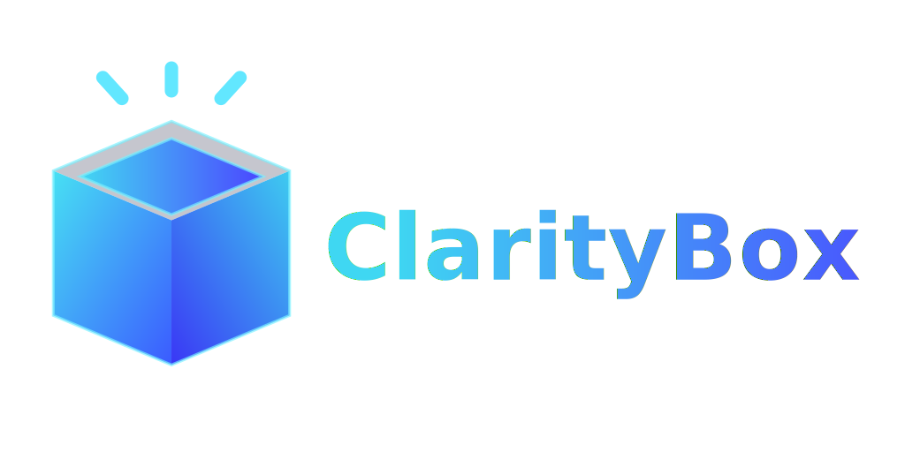

# ClarityBox

> **Full Stack Project by Gal Ben Abu**  
> A productivity platform where **gratitude journaling** ✨📝 meets **project & task management** 🧩🎯<br>built as the final project for HackerU’s Full-Stack Web Development course.

<p align="center" style="display: flex; flex-direction: column; align-items: center;">
  
  <div style="display: flex; align-items: center; justify-content: center; margin-top: -3rem; gap: 1rem;">
  <a href="./server/README.md">
    
  </a>
  <a href="./client/README.md">
    
  </a>
  <a href="./docs/README.md">
    
  </a>
  </div>
</p>

---

## 📘 Overview

**ClarityBox** unifies reflection and productivity in one web app.

-   **Gratitude Tracker** — record daily wins and promote a positive mindset.
-   **Project & Task Manager** — set goals, track progress, and stay organized.

> **Current stage:** Backend MVP completed (`v0.2.1-alpha`) ✅  
> **Next:** Frontend development and full API integration.

---

## 🧱 Tech Stack

| Layer | Technologies |
| :-- | :-- |
| **Frontend** | [React](https://react.dev) · [TypeScript](https://www.typescriptlang.org) · [Vite](https://vitejs.dev) · [TailwindCSS](https://tailwindcss.com) |
| **Backend** | [Node.js](https://nodejs.org) · [Express](https://expressjs.com) · [MongoDB](https://www.mongodb.com) |
| **Authentication** | [JWT](https://jwt.io) · [bcrypt](https://www.npmjs.com/package/bcrypt) |
| **Validation** | [Joi](https://joi.dev) · [Mongoose Validation](https://mongoosejs.com/docs/validation.html) |
| **Logging** | [Winston](https://github.com/winstonjs/winston) · [Morgan](https://github.com/expressjs/morgan) |
| **CI/CD & Automation** | [GitHub Actions](https://github.com/features/actions) - automated changelog, todo tracking, and documentation snapshots |
| **Docs & Planning** | Markdown · Draw.io diagrams · auto-generated folder structure `HTML` `<pre>` tag block via custom scripts |

---

## 🧩 Development Progress

| Version | Date | Status | Summary |
| :-- | :-: | :-: | :-- |
| **Next** | **WIP** | 🏗️ | Begin frontend MVP and API integration |
| [`v0.2.1-alpha`](https://github.com/Gallucky/ClarityBox/releases/tag/v0.2.1-alpha) | 26-10-2025 | ✅ | Added initial data generation service (`initialDataService.js`) integrated into server startup. Includes default users, posts, projects, and tasks for ClarityBox MVP. |
| [`v0.2.0-alpha`](https://github.com/Gallucky/ClarityBox/releases/tag/v0.2.0-alpha) | 24-10-2025 | ✅ | ClarityBox Server MVP release — complete CRUD routes, validation, and modular backend structure. |
| [`v0.1.4-alpha`](https://github.com/Gallucky/ClarityBox/releases/tag/v0.1.4-alpha) | 16-10-2025 | ✅ | Centralized error handling, added local validations, improved user routes, began work on posts routes. |
| [`v0.1.3-alpha`](https://github.com/Gallucky/ClarityBox/releases/tag/v0.1.3-alpha) | 15-10-2025 | ✅ | Completed MVP CRUD for user model, updated README, added Git tag guide. |
| [`v0.1.2-alpha`](https://github.com/Gallucky/ClarityBox/releases/tag/v0.1.2-alpha) | 09-10-2025 | ✅ | Improved project documentation and began implementing server routes. |
| [`v0.1.1-alpha`](https://github.com/Gallucky/ClarityBox/releases/tag/v0.1.1-alpha) | 05-10-2025 | ✅ | Added automation scripts and backup logic for changelog and todo tracking workflows. |
| [`v0.1.0-alpha`](https://github.com/Gallucky/ClarityBox/releases/tag/v0.1.0-alpha) | 03-10-2025 | ✅ | Backend foundation — authentication system, user module, and base architecture. |

> Early commits (~150) from the deprecated [`testing/workflows`](https://github.com/Gallucky/ClarityBox/tree/testing/workflows) branch were preserved for transparency and later squash-merged into [`dev`](https://github.com/Gallucky/ClarityBox/tree/dev).  
> Ongoing development continues in `dev`; stable builds merge into [`main`](https://github.com/Gallucky/ClarityBox/tree/main).

---

## 🧭 Folder Structure

<!--
📁 Auto-generated folder tree — created by the generate-html-tree.js script.
Keep this file (or its contents) in the same directory as the input path.
Moving it elsewhere will break the relative links to files and folders.
-->
<pre style="
  font-family: 'Fira Code', 'Consolas', 'Courier New', monospace;
  font-size: 14px;
  line-height: 1.5;
  color: #eaeaea;
  background-color: #1e1e1e;
  padding: 1rem;
  border-radius: 10px;
  overflow-x: auto;
">
📦 <strong style="color: #ce966e">ClarityBox/</strong>
├── 📁 <a href="./client/">client/</a> - <strong>React frontend</strong>
│   ├── 📁 <a href="./client/public/">public/</a>
│   ├── 📁 <a href="./client/src/">src/</a>
│   ├── 📄 <a href="./client/index.html">index.html</a>
│   ├── 📄 <a href="./client/package-lock.json">package-lock.json</a>
│   ├── 📄 <a href="./client/package.json">package.json</a>
│   ├── 📄 <a href="./client/README.md">README.md</a>
│   ├── 📄 <a href="./client/eslint.config.js">eslint.config.js</a>
│   ├── 📄 <a href="./client/eslint.config.ts">eslint.config.ts</a>
│   ├── 📄 <a href="./client/tsconfig.app.json">tsconfig.app.json</a>
│   ├── 📄 <a href="./client/tsconfig.json">tsconfig.json</a>
│   ├── 📄 <a href="./client/tsconfig.node.json">tsconfig.node.json</a>
│   └── 📄 <a href="./client/vite.config.ts">vite.config.ts</a>
├── 📁 <a href="./docs/">docs/</a> - <strong>Planning & Architecture</strong>
│   ├── 📁 <a href="./docs/assets/">assets/</a>
│   ├── 📄 <a href="./docs/architecture.md">architecture.md</a>
│   ├── 📄 <a href="./docs/database.md">database.md</a>
│   ├── 📄 <a href="./docs/requirements.md">requirements.md</a>
│   └── 📄 <a href="./docs/ui.md">ui.md</a>
├── 📁 <a href="./scripts/">scripts/</a> - <strong>Helper scripts</strong>
│   ├── 📁 <a>generated/</a>
│   └── 📁 <a href="./scripts/utils/">utils/</a>
│   ├── 📄 <a href="./scripts/create-edit-issue-labels.ps1">create-edit-issue-labels.ps1</a>
│   ├── 📄 <a href="./scripts/generate-folder-tree.js">generate-folder-tree.js</a>
│   ├── 📄 <a href="./scripts/generate-issues-via-csv.ps1">generate-issues-via-csv.ps1</a>
├── 📁 <a href="./server/">server/</a> - <strong> Node.js + Express backend</strong>
│   ├── 📁 <a href="./server/auth/">auth/</a>
│   ├── 📁 <a href="./server/DB/">DB/</a>
│   ├── 📁 <a href="./server/features/">features/</a>
│   ├── 📁 <a href="./server/initialData/">initialData/</a>
│   ├── 📁 <a href="./server/logger/">logger/</a>
│   ├── 📁 <a href="./server/middlewares/">middlewares/</a>
│   ├── 📁 <a href="./server/router/">router/</a>
│   └── 📁 <a href="./server/utils/">utils/</a>
│   ├── 📄 <a href="./server/package-lock.json">package-lock.json</a>
│   ├── 📄 <a href="./server/package.json">package.json</a>
│   ├── 📄 <a href="./server/server.js">server.js</a>
│   ├── 📄 <a href="./server/README.md">README.md</a>
│   ├── 📄 <a href="./server/eslint.config.mjs">eslint.config.mjs</a>
├── 📄 <a href="./package.json">package.json</a>
├── 📄 <a href="./README.md">README.md</a>
├── 📄 <a href="./Changelog.md">Changelog.md</a>
└── 📄 <a href="./Todo.md">Todo.md</a>
</pre>

---

## 🧰 Setup Instructions

### Prerequisites

-   Node.js 20+
-   MongoDB (local or Atlas)
-   npm or pnpm

### Installation

```bash
# Clone the repository
git clone https://github.com/Gallucky/ClarityBox.git

# Navigate to the project directory
cd ClarityBox

# Install dependencies
npm install
```

### Run backend

```bash
# Navigate to the server directory
cd server

# Start the server in development mode
npm run dev
```

### Run frontend

```bash
# Navigate to the client directory
cd client

# Start the client in development mode
npm run dev
```

---

## 🗺️ Roadmap

| Phase | Focus                                                            |
| :---- | :--------------------------------------------------------------- |
| 🧩 1  | ✅ Backend MVP completed (auth, CRUD, validations, logging)      |
| 🎨 2  | 🚧 Frontend MVP — dashboard, gratitude boxes UI, API integration |
| ⚙️ 3  | 📅 Extended features — favorites, filters, admin panel           |
| 🌐 4  | ☁️ Deployment & public demo                                      |

---

## 🧪 Notes

-   Early commit history intentionally preserved for transparency — this project documents both **learning and implementation**.
-   Modular routes, centralized validation, and structured error handling.
-   Logging via Winston + Morgan for all HTTP requests.
-   Automated documentation updates tracked with GitHub Actions.
-   Future versions will include structured documentation and API reference under [`/docs`](./docs/).

---

## 📜 License

MIT License © 2025 Gal Ben Abu
