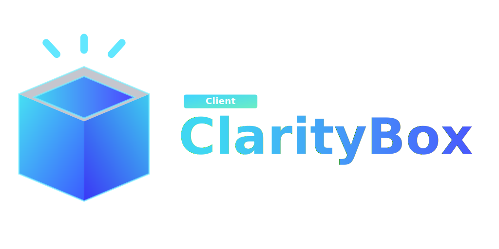

# ClarityBox Client

<p align="center" style="display: flex; flex-direction: column; align-items: center;">
  <a href="../README.md">
    
  </a>
  <div style="display: flex; align-items: center; justify-content: center; margin-top: -3rem; gap: 1rem;">
  <a href="../server/README.md">
    
  </a>
  <a href="../README.md">
    
  </a>
  <a href="../docs/README.md">
    
  </a>
  </div>
</p>

<!-- Auto-generated by generate-html-tree.js -->
<pre style="
  font-family: 'Fira Code', 'Consolas', 'Courier New', monospace;
  font-size: 14px;
  line-height: 1.5;
  color: #eaeaea;
  background-color: #1e1e1e;
  padding: 1rem;
  border-radius: 10px;
  overflow-x: auto;
">
📦 <strong>client/</strong>
├── 📁 <a href="./public/">public/</a>
│   ├── 📄 <a href="./public/claritybox-icon.svg">claritybox-icon.svg</a>
│   └── 📄 <a href="./public/vite.svg">vite.svg</a>
├── 📁 <a href="./src/">src/</a>
│   ├── 📁 <a href="./src/app/">app/</a>
│   │   ├── 📁 <a href="./src/app/providers/">providers/</a>
│   │   │   ├── 📁 <a href="./src/app/providers/Auth/">Auth/</a>
│   │   │   │   ├── 📄 <a href="./src/app/providers/Auth/AuthProvider.tsx">AuthProvider.tsx</a>
│   │   │   │   └── 📄 <a href="./src/app/providers/Auth/useAuth.ts">useAuth.ts</a>
│   │   │   ├── 📁 <a href="./src/app/providers/Query/">Query/</a>
│   │   │   │   ├── 📄 <a href="./src/app/providers/Query/QueryProvider.tsx">QueryProvider.tsx</a>
│   │   │   │   └── 📄 <a href="./src/app/providers/Query/useApiQuery.ts">useApiQuery.ts</a>
│   │   │   └── 📄 <a href="./src/app/providers/ThemeProvider.tsx">ThemeProvider.tsx</a>
│   │   └── 📁 <a href="./src/app/router/">router/</a>
│   │       ├── 📄 <a href="./src/app/router/RouteGuard.tsx">RouteGuard.tsx</a>
│   │       ├── 📄 <a href="./src/app/router/router.tsx">router.tsx</a>
│   │       └── 📄 <a href="./src/app/router/RoutesHandler.tsx">RoutesHandler.tsx</a>
│   ├── 📁 <a href="./src/assets/">assets/</a>
│   │   └── 📄 <a href="./src/assets/react.svg">react.svg</a>
│   ├── 📁 <a href="./src/components/">components/</a>
│   │   ├── 📁 <a href="./src/components/box/">box/</a>
│   │   │   ├── 📁 <a href="./src/components/box/gratitudeCard/">gratitudeCard/</a>
│   │   │   └── 📁 <a href="./src/components/box/project/">project/</a>
│   │   ├── 📁 <a href="./src/components/form/">form/</a>
│   │   ├── 📁 <a href="./src/components/icons/">icons/</a>
│   │   ├── 📁 <a href="./src/components/layout/">layout/</a>
│   │   └── 📁 <a href="./src/components/ui/">ui/</a>
│   ├── 📁 <a href="./src/hooks/">hooks/</a>
│   ├── 📁 <a href="./src/lib/">lib/</a>
│   ├── 📁 <a href="./src/pages/">pages/</a>
│   │   ├── 📁 <a href="./src/pages/About/">About/</a>
│   │   ├── 📁 <a href="./src/pages/Admin/">Admin/</a>
│   │   ├── 📁 <a href="./src/pages/Dashboard/">Dashboard/</a>
│   │   ├── 📁 <a href="./src/pages/GratitudeBoxes/">GratitudeBoxes/</a>
│   │   ├── 📁 <a href="./src/pages/Home/">Home/</a>
│   │   ├── 📁 <a href="./src/pages/Login/">Login/</a>
│   │   ├── 📁 <a href="./src/pages/NotFound/">NotFound/</a>
│   │   ├── 📁 <a href="./src/pages/Profile/">Profile/</a>
│   │   ├── 📁 <a href="./src/pages/Projects/">Projects/</a>
│   │   ├── 📁 <a href="./src/pages/Registration/">Registration/</a>
│   │   └── 📁 <a href="./src/pages/Tasks/">Tasks/</a>
│   ├── 📁 <a href="./src/store/">store/</a>
│   ├── 📁 <a href="./src/styles/">styles/</a>
│   ├── 📁 <a href="./src/types/">types/</a>
│   ├── 📁 <a href="./src/utils/">utils/</a>
│   ├── 📄 <a href="./src/App.tsx">App.tsx</a>
│   ├── 📄 <a href="./src/index.css">index.css</a>
│   └── 📄 <a href="./src/main.tsx">main.tsx</a>
├── 📄 <a href="./eslint.config.js">eslint.config.js</a>
├── 📄 <a href="./index.html">index.html</a>
├── 📄 <a href="./package-lock.json">package-lock.json</a>
├── 📄 <a href="./package.json">package.json</a>
├── 📄 <a href="./README.md">README.md</a>
├── 📄 <a href="./tsconfig.app.json">tsconfig.app.json</a>
├── 📄 <a href="./tsconfig.json">tsconfig.json</a>
├── 📄 <a href="./tsconfig.node.json">tsconfig.node.json</a>
└── 📄 <a href="./vite.config.ts">vite.config.ts</a>
</pre>

## React + TypeScript + Vite

This template provides a minimal setup to get React working in Vite with HMR and some ESLint rules.

Currently, two official plugins are available:

- [@vitejs/plugin-react](https://github.com/vitejs/vite-plugin-react/blob/main/packages/plugin-react) uses [Babel](https://babeljs.io/) (or [oxc](https://oxc.rs) when used in [rolldown-vite](https://vite.dev/guide/rolldown)) for Fast Refresh
- [@vitejs/plugin-react-swc](https://github.com/vitejs/vite-plugin-react/blob/main/packages/plugin-react-swc) uses [SWC](https://swc.rs/) for Fast Refresh

### React Compiler

The React Compiler is not enabled on this template because of its impact on dev & build performances. To add it, see [this documentation](https://react.dev/learn/react-compiler/installation).

## Expanding the ESLint configuration

If you are developing a production application, we recommend updating the configuration to enable type-aware lint rules:

```js
export default defineConfig([
    globalIgnores(["dist"]),
    {
        files: ["**/*.{ts,tsx}"],
        extends: [
            // Other configs...

            // Remove tseslint.configs.recommended and replace with this
            tseslint.configs.recommendedTypeChecked,
            // Alternatively, use this for stricter rules
            tseslint.configs.strictTypeChecked,
            // Optionally, add this for stylistic rules
            tseslint.configs.stylisticTypeChecked,

            // Other configs...
        ],
        languageOptions: {
            parserOptions: {
                project: ["./tsconfig.node.json", "./tsconfig.app.json"],
                tsconfigRootDir: import.meta.dirname,
            },
            // other options...
        },
    },
]);
```

You can also install [eslint-plugin-react-x](https://github.com/Rel1cx/eslint-react/tree/main/packages/plugins/eslint-plugin-react-x) and [eslint-plugin-react-dom](https://github.com/Rel1cx/eslint-react/tree/main/packages/plugins/eslint-plugin-react-dom) for React-specific lint rules:

```js
// eslint.config.js
import reactX from "eslint-plugin-react-x";
import reactDom from "eslint-plugin-react-dom";

export default defineConfig([
    globalIgnores(["dist"]),
    {
        files: ["**/*.{ts,tsx}"],
        extends: [
            // Other configs...
            // Enable lint rules for React
            reactX.configs["recommended-typescript"],
            // Enable lint rules for React DOM
            reactDom.configs.recommended,
        ],
        languageOptions: {
            parserOptions: {
                project: ["./tsconfig.node.json", "./tsconfig.app.json"],
                tsconfigRootDir: import.meta.dirname,
            },
            // other options...
        },
    },
]);
```
